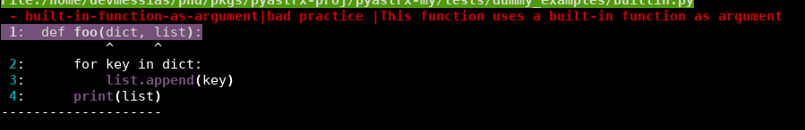

Default arguments
=================

Mutable default arguments
-------------------------

.. code:: yaml

    mutable-defaults:
        xpath: "//defaults/*[self::Dict or self::List or self::Set or self::Call]"
        description: "Can create bugs that are hard to find"
        severity: "error"
        why: "bad practice"

Global variables
================

Global definition
-----------------

.. code:: yaml

    global-keyword:
        xpath: "//FunctionDef/body/Global"
        description: "This can create annoying side effects"
        severity: "info"
        use_in_linter: false
        why: ""

Unnecessary global keyword in function
--------------------------------------

.. code:: yaml

    mutable-defaults:
        xpath: "//FunctionDef/body/Global/names[not(item=../../Assign/targets/Name/@id)]"
        description: "An unnecessary global keyword is being used"
        severity: "info"
        why: "bad practice"

Function definitions
====================

Recursion
---------

.. code:: yaml

    recursion:
        xpath: "//FunctionDef[@name=body//Call/func/Name/@id and not(parent::node()/parent::ClassDef)]"
        description: "Recursion pattern detected in this file"
        severity: "info"
        why: "should be refactored"

Recursion in a class method
---------------------------

This example also shows that we can use multiple lines to define 
a complex xpath expression.

.. code:: yaml

    recursion-class-method:
        xpath:
            |
            //ClassDef
              /body
                /FunctionDef[
                  @name=body
                  //Call
                    /func
                      /Attribute[
                        value/Name[@id='self']
                     ]
                     /@attr
                ]
        description: ""
        severity: "info"

New variable with the same name as the current function
-------------------------------------------------------

.. code:: yaml

    redefinition-of-function-var:
        xpath: "//FunctionDef[@name=body/Assign/targets/Name/@id]"
        description: "Please, avoid defining a new variable with the same name as the current function"
        severity: "error"
        why: "bad practice"

Allow and deny Lists
====================

Is possible to define allow and deny lists to be used in the expressions.
To do so, you need to add a `match_params` in the `pyastrx.yaml` file, like this:

.. code:: yaml

    match_params:
        allow_dict:
            list_name_1:
                - allowed_name_1
                - allowed_name_2
                - etc
        deny_dict:
            list_name_2:
                - denied_name_1
                - denied_name_2
                - etc

To use this lists on the xpath expressions, you must call the `pyastrx:allow-list` or
`pyastrx:deny-list` functions, let's see some examples:

Arguments replacing built-in functions
--------------------------------------

A hard behavior and bugs can be created if someone associate
an argument with the same name as a built-in function. For example,

.. code:: python

    def foo(dict, list):
        for key in dict:
            list.append(key)
        print(list)

create an entry in the `deny_dict` inside your `pyastrx.yaml` file:

.. code:: yaml

    match_params:
        deny_dict:
            built-in:
                - dict
                - list
                - ...

Now, you can use the following rule to detect this behavior:

.. code:: yaml

    built-in-function-as-argument:
        xpath:
            |
            //FunctionDef
              /args
                /arguments
                  /args
                    /Name[pyastrx:deny-list('built-in', @id)]
        description: "This function uses a built-in function as argument"
        severity: "error"
        why: "bad practice"

Allow list:

.. code::

    pyastrx:allow-list:[pyastrx:allow-list('list_name', @ATTR_TO_BE_CHECKED)]
